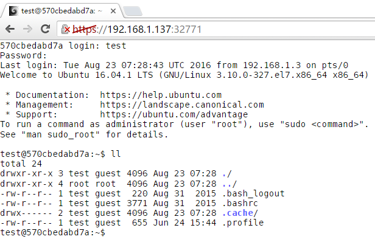

run shellinabox in docker container
===================================

hypercli + shellinabox(2.19)

# Build
```
$ git clone https://github.com/Jimmy-Xu/docker-shellinabox.git
$ cd docker-shellinabox
$ ./build.sh
```

# Run
```
$ ./run.sh
http://127.0.0.1:32771
user: test password: YzdhY2QyMjU0YWNmY2YxNWRmNWJmN2Q3
```

